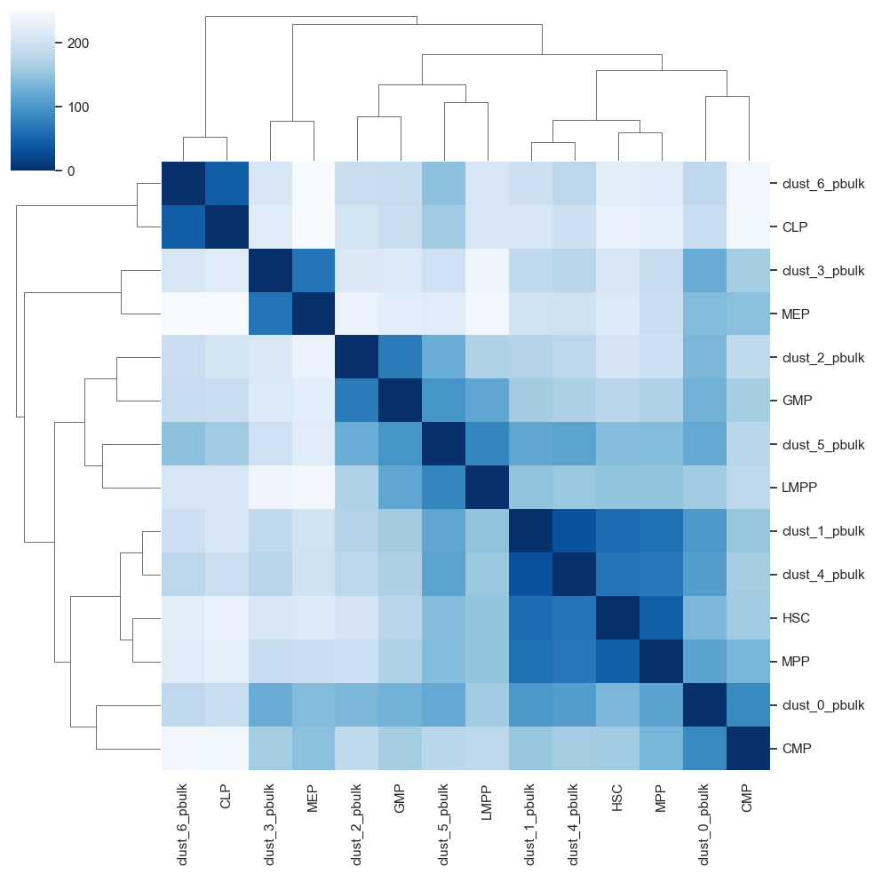

==================================================================
Tutorial
==================================================================

This notebook demonstrates how to use scATAcat, a tool designed for
annotationg cell-types in scATAC-seq data.

The necessary data to run the code provided below can be found
`here <https://nc.molgen.mpg.de/cloud/index.php/s/9jrwRGzHgST2NK7>`__.
Please download the data and ensure it is stored in a folder named `data`.

.. code:: ipython3

    import pickle
    import pandas as pd
    import sklearn
    import numpy as np
    import scanpy as sc
    import scipy.sparse
    import anndata
    import matplotlib.pylab as plt
    from sklearn.decomposition import PCA
    import copy
    import logging as logg
    from sklearn import preprocessing
    import os 
    import warnings
    import scATAcat
    import seaborn as sns
    import random as rn 
    
    warnings.filterwarnings('ignore')

.. code:: ipython3

    # set the seed for reproducibility
    sd = 1234
    np.random.seed(sd)
    rn.seed(sd)
    %env PYTHONHASHSEED=0

.. parsed-literal::

    env: PYTHONHASHSEED=0

define necessary parameters

.. code:: ipython3

    results_dir = "./results"
    output_dir = results_dir + "/outputs/"
    figures_dir = results_dir + "/figures/"
    data_dir = "./data/"
    
    for dir in [figures_dir, output_dir]:
        if not os.path.exists(dir):
            os.makedirs(dir)

0 - Load scATAC-seq data
~~~~~~~~~~~~~~~~~~~~~~~~

Here we load the scATAC-seq data from `Buenrostro et al.,
2018 <https://www.sciencedirect.com/science/article/pii/S009286741830446X?via%3Dihub>`__.
This datset comprises of 2,210 cells human hematopoietic progenitor
cells which are obtained from bone marrow and isolated via
fluorescence-activated cell sorting (FACS). FACS enables sorting of
single cells into a well plate using cell-type specific cell-surface
markers and thereby provides a true cell-type annotation for each cell
in the data. This means, we know the real cell-type identities of this
cells.

Here, `ENCODE
cCREs <https://www.nature.com/articles/s41586-020-2493-4>`__ are used as
the reference frame/features. We calculated the cCRE coverages for each
cell, which is provided in ``data/matrix_sparse.pkl``. The column and
index IDs of this matrix are given in ``data/cell_IDs.csv`` and
``features.csv``, respectively.

.. code:: ipython3

    ENCODE_coverage_per_cell_df= pickle.load(open(data_dir + 'matrix_sparse.pkl','rb'))

.. code:: ipython3

    ENCODE_coverage_per_cell_df

.. parsed-literal::

    <926535x2210 sparse matrix of type '<class 'numpy.float32'>'
    	with 18562502 stored elements in Compressed Sparse Row format>

.. code:: ipython3

    ENCODE_cCREs = pd.read_csv(data_dir +"features.csv", index_col=0)
    ENCODE_cCREs.index.name = None
    ENCODE_cCREs.columns = ['cCREs']
    ENCODE_cCREs.head()

.. raw:: html

    

    
    <table border="1" class="dataframe">
      <thead>
        <tr style="text-align: right;">
          <th></th>
          <th>cCREs</th>
        </tr>
      </thead>
      <tbody>
        <tr>
          <th>chr1_181251_181601</th>
          <td>chr1_181251_181601</td>
        </tr>
        <tr>
          <th>chr1_190865_191071</th>
          <td>chr1_190865_191071</td>
        </tr>
        <tr>
          <th>chr1_778562_778912</th>
          <td>chr1_778562_778912</td>
        </tr>
        <tr>
          <th>chr1_779086_779355</th>
          <td>chr1_779086_779355</td>
        </tr>
        <tr>
          <th>chr1_779727_780060</th>
          <td>chr1_779727_780060</td>
        </tr>
      </tbody>
    </table>
    

.. code:: ipython3

    cell_IDs = pd.read_csv(data_dir +"cell_IDs.csv", index_col=0)
    cell_IDs.index.name = None
    cell_IDs.columns = ['cell_IDs']
    cell_IDs.head()

.. raw:: html

    

    
    <table border="1" class="dataframe">
      <thead>
        <tr style="text-align: right;">
          <th></th>
          <th>cell_IDs</th>
        </tr>
      </thead>
      <tbody>
        <tr>
          <th>CLP_0</th>
          <td>CLP_0</td>
        </tr>
        <tr>
          <th>CLP_1</th>
          <td>CLP_1</td>
        </tr>
        <tr>
          <th>CMP_0</th>
          <td>CMP_0</td>
        </tr>
        <tr>
          <th>CMP_1</th>
          <td>CMP_1</td>
        </tr>
        <tr>
          <th>CMP_2</th>
          <td>CMP_2</td>
        </tr>
      </tbody>
    </table>
    

1 - initialize the AnnData object
~~~~~~~~~~~~~~~~~~~~~~~~~~~~~~~~~

scATAcat relies on
`AnnData <https://anndata.readthedocs.io/en/latest/>`__ package when
working with datasets. Here we define an AnnData object from our
scATAC-seq data. Note that AmnnData requires observations as the columns
and variables as indexes. We use `csr
matrix <https://docs.scipy.org/doc/scipy/reference/generated/scipy.sparse.csr_matrix.html>`__
format.

.. code:: ipython3

    sc_completeFeatures_adata = anndata.AnnData(ENCODE_coverage_per_cell_df.transpose().tocsr(), var=ENCODE_cCREs, obs=cell_IDs)

.. code:: ipython3

    sc_completeFeatures_adata

.. parsed-literal::

    AnnData object with n_obs × n_vars = 2210 × 926535
        obs: 'cell_IDs'
        var: 'cCREs'

2 - add binary layer to AnnData
~~~~~~~~~~~~~~~~~~~~~~~~~~~~~~~

We binarize the matrix to enable further processing and filtering. This
new matrix is added as a new layer to our AnnData object with the
keyword “binary”.

.. code:: ipython3

    scATAcat.add_binary_layer(sc_completeFeatures_adata, binary_layer_key="binary")

.. parsed-literal::

    AnnData object with n_obs × n_vars = 2210 × 926535
        obs: 'cell_IDs'
        var: 'cCREs'
        layers: 'binary'

3- calculate & plot cell and feature statistics
~~~~~~~~~~~~~~~~~~~~~~~~~~~~~~~~~~~~~~~~~~~~~~~

``cell_feature_statistics()`` function calculates the quality features
like “number of features per cell” and “number of cells per feature”.
``plot_feature_statistics()`` and ``plot_cell_statistics()`` functions
enables viuzalizations of these quality features.

.. code:: ipython3

    scATAcat.cell_feature_statistics(sc_completeFeatures_adata, binary_layer_key ='binary')

.. parsed-literal::

    AnnData object with n_obs × n_vars = 2210 × 926535
        obs: 'cell_IDs'
        var: 'cCREs'
        obsm: 'num_feature_per_cell'
        varm: 'num_cell_per_feature'
        layers: 'binary'

.. code:: ipython3

    scATAcat.plot_feature_statistics(sc_completeFeatures_adata, threshold=3, bins=50, color="lightgrey", save=True, save_dir = figures_dir +"/feature_statistics_plot.png")

.. parsed-literal::

    AnnData object with n_obs × n_vars = 2210 × 926535
        obs: 'cell_IDs'
        var: 'cCREs'
        obsm: 'num_feature_per_cell'
        varm: 'num_cell_per_feature'
        layers: 'binary'

.. image:: tutorial_files/tutorial_17_1.png

.. code:: ipython3

    scATAcat.plot_cell_statistics(sc_completeFeatures_adata, threshold=1000, bins=50, color="lightgrey", save=True, save_dir = figures_dir + "/cell_statistics_plot.png")

.. parsed-literal::

    AnnData object with n_obs × n_vars = 2210 × 926535
        obs: 'cell_IDs'
        var: 'cCREs'
        obsm: 'num_feature_per_cell'
        varm: 'num_cell_per_feature'
        layers: 'binary'

.. image:: tutorial_files/tutorial_18_1.png

4- filter the cells and features
~~~~~~~~~~~~~~~~~~~~~~~~~~~~~~~~

``preproces_sc_matrix()`` function is used to filter unwanted cells and
features. By default, eatures which occur in less than
``feature_cutoff=3`` cells get eliminated. In the level of cells, we
filter out cells with fewer than ``feature_cutoff=1000`` and more than
``cell_cutoff_max=80000`` non-zero features. Additionally, we get rid of
the features within Y chromosome to avoid gender biases, controlled by
``remove_chrY = True`` paramater.

.. code:: ipython3

    sc_completeFeatures_adata

.. parsed-literal::

    AnnData object with n_obs × n_vars = 2210 × 926535
        obs: 'cell_IDs'
        var: 'cCREs'
        obsm: 'num_feature_per_cell'
        varm: 'num_cell_per_feature'
        layers: 'binary'

.. code:: ipython3

    sc_filteredFeatures_adata = scATAcat.preproces_sc_matrix(sc_completeFeatures_adata,cell_cutoff=1000,cell_cutoff_max=80000, feature_cutoff=3, remove_chrY = True, var_key = 'cCREs', copy=True)

.. code:: ipython3

    sc_filteredFeatures_adata

.. parsed-literal::

    View of AnnData object with n_obs × n_vars = 1872 × 501699
        obs: 'cell_IDs'
        var: 'cCREs'
        obsm: 'num_feature_per_cell'
        varm: 'num_cell_per_feature'
        layers: 'binary'

note that here we filtered almost half of the features!

5- load & preprocess the bulk data
~~~~~~~~~~~~~~~~~~~~~~~~~~~~~~~~~~

scATAcat requires bulk prototype data to provide cell-type annotation
for query scATAC-seq data. For this tutorial, we use prototype
cell-types derived from bulk ATAC-seq data of hematopoietic progenitors
from `Corces et al., 2016 <https://www.nature.com/articles/ng.3646>`__.
This dataset comprises of bulk ATAC-seq data of hematopoietic
progenitors, serving as an perfect example for our purposes. An AnnData
object containing this dataset can easily be generated using the
``generate_bulk_sparse_AnnData()`` function, which prepares the data in
a format suitable for scATAcat analysis. ``data/bulk_prototypes.pkl``
matrix includes the cCRE coverages of each bulk sample.

.. code:: ipython3

    bulk_by_ENCODE_peaks_df_annotated = pickle.load(open(data_dir + 'bulk_prototypes.pkl','rb'))

.. code:: ipython3

    bulk_completeFeatures_adata = scATAcat.generate_bulk_sparse_AnnData(bulk_by_ENCODE_peaks_df_annotated)

.. code:: ipython3

    bulk_completeFeatures_adata

.. parsed-literal::

    AnnData object with n_obs × n_vars = 43 × 926535
        obs: 'cell_types'
        var: 'cCREs'

``preprocess_bulk_adata()`` function preprocesses prototype/bulk AnnData
by optionally removing features associated with chromosome Y, controlled
by ``remove_chrY = True`` paramater.

.. code:: ipython3

    bulk_completeFeatures_adata = scATAcat.preprocess_bulk_adata(bulk_completeFeatures_adata, remove_chrY=True, var_key = 'cCREs', copy=False)

6 - Overlap bulk and sc features
~~~~~~~~~~~~~~~~~~~~~~~~~~~~~~~~

Before we proceed with our analysis, it’s essential to align the
features between the bulk and single-cell (sc) AnnData objects. Although
we initially used the same set of candidate cis-regulatory elements
(cCREs), different filtering criteria applied to the bulk and sc data
may have resulted in discrepancies. A unified feature set is crucial for
integrating these datasets effectively. We define the common variables
with ``overlap_vars()`` function and subset both the AnnData objects to
these common variables using ``subset_adata_vars()`` function.

.. code:: ipython3

    sc_bulk_common_vars = scATAcat.overlap_vars(sc_filteredFeatures_adata, bulk_completeFeatures_adata)

.. code:: ipython3

    len(sc_bulk_common_vars)

.. parsed-literal::

    501699

.. code:: ipython3

    sc_commonFeatures_adata = scATAcat.subset_adata_vars(sc_filteredFeatures_adata, vars_list=sc_bulk_common_vars, copy_=True)

.. code:: ipython3

    bulk_commonFeatures_adata = scATAcat.subset_adata_vars(bulk_completeFeatures_adata, vars_list=sc_bulk_common_vars, copy_=True)

7- doublet removal
~~~~~~~~~~~~~~~~~~

If you’ve applied a doublet detection algorithm, this is a good place to
remove these cells from your analysis. In our case, removal isn’t
necessary as our data was obtained from sorted individual cells.
However, we strongly recommend removing doublets from the analysis, as
these cells can significantly impact downstream analysis. We have used
`AMULET <https://genomebiology.biomedcentral.com/articles/10.1186/s13059-021-02469-x>`__
and have achieved good results with it.

8- apply TF-IDF
~~~~~~~~~~~~~~~

We continue with processign our sc data. We apply TF-logIDF
normalization. This results in re-weighted features (cCREs) by assigning
greater weight to more important features.

.. code:: ipython3

    scATAcat.apply_TFIDF_sparse(sc_commonFeatures_adata, binary_layer_key='binary', TFIDF_key='TF_logIDF' )

.. parsed-literal::

    AnnData object with n_obs × n_vars = 1872 × 501699
        obs: 'cell_IDs'
        var: 'cCREs'
        obsm: 'num_feature_per_cell'
        varm: 'num_cell_per_feature'
        layers: 'binary', 'TF_logIDF'

9 - subset matrices to differential cCREs
~~~~~~~~~~~~~~~~~~~~~~~~~~~~~~~~~~~~~~~~~

Next, we subset the data to focus on the differential cCREs as defined
by the reference bulk ATAC-seq data. These regions are identified using
the DiffBind R package (version 3.0) by conducting pairwise comparisons
between each cell type. The file ``data/differential_features.csv``
contains the union of the top 2000 differential cCREs from each
comparison

We next subset both the sc and bulk AnnData objects to these
differential regions with the assumption that these specific cCREs
contain the most discriminative information and are indicative of
cell-type specificity.

.. code:: ipython3

    pairwise_top2000_cCREs = pd.read_table(data_dir +'/differential_features.csv',delimiter="\t",header=None)
    
    pairwise_top2000_cCREs.head()

.. raw:: html

    

    
    <table border="1" class="dataframe">
      <thead>
        <tr style="text-align: right;">
          <th></th>
          <th>0</th>
        </tr>
      </thead>
      <tbody>
        <tr>
          <th>0</th>
          <td>chr1_1842820_1843169</td>
        </tr>
        <tr>
          <th>1</th>
          <td>chr1_1895700_1895891</td>
        </tr>
        <tr>
          <th>2</th>
          <td>chr1_1895944_1896292</td>
        </tr>
        <tr>
          <th>3</th>
          <td>chr1_1966481_1966686</td>
        </tr>
        <tr>
          <th>4</th>
          <td>chr1_2045674_2045954</td>
        </tr>
      </tbody>
    </table>
    

.. code:: ipython3

    len(pairwise_top2000_cCREs)

.. parsed-literal::

    21034

.. code:: ipython3

    common_differential_vars = list(set(list(sc_bulk_common_vars)) & set(list(pairwise_top2000_cCREs[0].tolist())))
    
    len(common_differential_vars)

.. parsed-literal::

    19412

.. code:: ipython3

    bulk_commonDiffFeatures_adata = scATAcat.subset_adata_vars(bulk_commonFeatures_adata,
                                                     vars_list=common_differential_vars,
                                                     copy_=True)

.. code:: ipython3

    sc_commonDiffFeatures_adata = scATAcat.subset_adata_vars(sc_commonFeatures_adata,
                                                     vars_list=common_differential_vars,
                                                     copy_=True)

10- dimention reduction and clustering
~~~~~~~~~~~~~~~~~~~~~~~~~~~~~~~~~~~~~~

The next step is dimension reduction. We apply principal component
analysis (PCA) using ``apply_PCA()`` function. Sometimes the first
principal component may capture the variation in the sequencing depth
among among cells rather than biological variation. In such instances,
it might be advisable to exclude the first PC. Below, we examine whether
there is such an association.

.. code:: ipython3

    scATAcat.apply_PCA(sc_commonDiffFeatures_adata, layer_key ='TF_logIDF', svd_solver='arpack', random_state=0)

.. parsed-literal::

    AnnData object with n_obs × n_vars = 1872 × 19412
        obs: 'cell_IDs'
        var: 'cCREs'
        uns: 'pca'
        obsm: 'num_feature_per_cell', 'X_pca'
        varm: 'num_cell_per_feature', 'PCs'
        layers: 'binary', 'TF_logIDF'

.. code:: ipython3

    with plt.rc_context():
        sc.pl.pca_variance_ratio(sc_commonDiffFeatures_adata, n_pcs=50, log=True, show=False)
        plt.savefig(figures_dir + "/pca_variance_ratio.pdf", bbox_inches="tight")

.. image:: tutorial_files/tutorial_46_0.png

.. code:: ipython3

    seqDepth_PC1_plot = sns.jointplot(
        x=sc_commonDiffFeatures_adata.obsm['X_pca'][:,0],
        y=np.sqrt(sc_commonDiffFeatures_adata.obsm['num_feature_per_cell']),
        kind="kde",fill=True
    )

.. image:: tutorial_files/tutorial_47_0.png

11 - apply UMAP & leiden clustering
~~~~~~~~~~~~~~~~~~~~~~~~~~~~~~~~~~~

Next, we compute the nearest neighbors and apply Leiden clustering.
These clusters are then visualized in a low-dimensional UMAP embedding.
Note that we these funtions are borrowed from
`ScanPy <https://scanpy.readthedocs.io/en/latest/index.html>`__ package.

.. code:: ipython3

    sc.pp.neighbors(sc_commonDiffFeatures_adata, n_pcs = 50, n_neighbors = 30, random_state=0)

.. code:: ipython3

    leiden_resolution=0.4
    leiden_key="leiden_"+ str(leiden_resolution)

.. code:: ipython3

    sc.tl.umap(sc_commonDiffFeatures_adata, random_state=0)

.. code:: ipython3

    sc.tl.leiden(sc_commonDiffFeatures_adata, resolution=leiden_resolution,key_added=leiden_key, random_state=0)

.. code:: ipython3

    # one can explicity specify the colors of their liking
    sc_commonDiffFeatures_adata.uns[leiden_key +'_colors'] = ['#1f77b4',
    '#ff7f0e',
    '#d62728',
    '#8c564b',
    '#e377c2',
    '#bcbd22',
    '#17becf',
    '#2ca02c']

.. code:: ipython3

    with plt.rc_context():
        sc.pl.umap(sc_commonDiffFeatures_adata, color=leiden_key, show=False,size=35 , add_outline=False, frameon=False, title="")
        plt.savefig(figures_dir + "/"+ leiden_key+ ".pdf", bbox_inches="tight")

.. image:: tutorial_files/tutorial_54_0.png

We can also examine the sequencing depth of cells to determine if it
impacts the clustering results:

.. code:: ipython3

    sc_commonDiffFeatures_adata.obs['num_feature_per_cell_'] = sc_commonDiffFeatures_adata.obsm['num_feature_per_cell']

.. code:: ipython3

    
    with plt.rc_context():  
        sc.pl.umap(sc_commonDiffFeatures_adata, color='num_feature_per_cell_', add_outline=False, frameon=False,title ="", save=False, size=25 )
        plt.savefig(figures_dir + "/seq_depth_umap.pdf", bbox_inches="tight")

.. parsed-literal::

    <Figure size 640x480 with 0 Axes>

12 - create pseudobulks according to the cluster assignments
~~~~~~~~~~~~~~~~~~~~~~~~~~~~~~~~~~~~~~~~~~~~~~~~~~~~~~~~~~~~

We form pseudobulks by aggregating the cells in each cluster.
``get_pseudobulk_matrix_ext()`` function is used to obtain pseudobulk
matrix and ``generate_bulk_sparse_AnnData()`` is repurposed to generate
an AnnData object for the pseudobulks. Note that the pseudobulk matrix
has the common cCREs as variables.

.. code:: ipython3

    cell_cluster_assignments = pd.DataFrame(sc_commonDiffFeatures_adata.obs[leiden_key].copy())
    cell_cluster_assignments

.. raw:: html

    

    
    <table border="1" class="dataframe">
      <thead>
        <tr style="text-align: right;">
          <th></th>
          <th>leiden_0.4</th>
        </tr>
      </thead>
      <tbody>
        <tr>
          <th>CLP_1</th>
          <td>6</td>
        </tr>
        <tr>
          <th>CMP_0</th>
          <td>0</td>
        </tr>
        <tr>
          <th>CMP_1</th>
          <td>0</td>
        </tr>
        <tr>
          <th>CMP_2</th>
          <td>0</td>
        </tr>
        <tr>
          <th>CMP_3</th>
          <td>3</td>
        </tr>
        <tr>
          <th>...</th>
          <td>...</td>
        </tr>
        <tr>
          <th>LMPP_90</th>
          <td>5</td>
        </tr>
        <tr>
          <th>LMPP_91</th>
          <td>5</td>
        </tr>
        <tr>
          <th>LMPP_93</th>
          <td>5</td>
        </tr>
        <tr>
          <th>LMPP_94</th>
          <td>5</td>
        </tr>
        <tr>
          <th>LMPP_95</th>
          <td>5</td>
        </tr>
      </tbody>
    </table>
    
1872 rows × 1 columns

    

.. code:: ipython3

    cell_cluster_sizes = pd.DataFrame(cell_cluster_assignments[leiden_key].value_counts())
    cell_cluster_sizes['leiden_clusters'] = cell_cluster_sizes.index
    cell_cluster_sizes.head()

.. raw:: html

    

    
    <table border="1" class="dataframe">
      <thead>
        <tr style="text-align: right;">
          <th></th>
          <th>count</th>
          <th>leiden_clusters</th>
        </tr>
        <tr>
          <th>leiden_0.4</th>
          <th></th>
          <th></th>
        </tr>
      </thead>
      <tbody>
        <tr>
          <th>0</th>
          <td>614</td>
          <td>0</td>
        </tr>
        <tr>
          <th>1</th>
          <td>359</td>
          <td>1</td>
        </tr>
        <tr>
          <th>2</th>
          <td>233</td>
          <td>2</td>
        </tr>
        <tr>
          <th>3</th>
          <td>227</td>
          <td>3</td>
        </tr>
        <tr>
          <th>4</th>
          <td>210</td>
          <td>4</td>
        </tr>
      </tbody>
    </table>
    

.. code:: ipython3

    for clust_id in set(sc_commonDiffFeatures_adata.obs[leiden_key].values):
        clust_df= sc_commonDiffFeatures_adata[sc_commonDiffFeatures_adata.obs[leiden_key]==clust_id]

.. code:: ipython3

    cell_types = ([(r.split('_')[0]) for r in clust_df.obs[leiden_key].index])

.. code:: ipython3

    # plot a bar chart
    sns.set_style("whitegrid")
    ax= sns.barplot(
        y="count", 
        x="leiden_clusters", 
        data=cell_cluster_sizes, 
        color='lightgrey');
    ax.yaxis.grid(True,color="lightgrey")
    ax.axes.set_xlabel("Leiden cluster ID")
    ax.axes.set_ylabel("cluster size")
    #atickt(yticks=(list(range(0,1500,100))))
    plt.savefig(figures_dir + "/cluster_sizes_"+leiden_key+".pdf", dpi=250)

.. image:: tutorial_files/tutorial_63_0.png

13 - Coembedding prototypes with pseudobulks in PCA space
~~~~~~~~~~~~~~~~~~~~~~~~~~~~~~~~~~~~~~~~~~~~~~~~~~~~~~~~~

We preprocess both the bulk and pseudobulk data prior to co-embedding.

First, we apply library size normalization and log2 transformation to
the datasets using the ``preprocessing_libsize_norm_log2()`` function,
then subset the matrices to include only differential cCREs.

Next, we perform z-normalization using the
``preprocessing_standardization()`` function. This function can also
accept external parameters for standard deviation (``std_``) and mean
(``mean_``). When normalizing the pseudobulk matrix, we utilize the
std\_ and mean\_ values from the bulk AnnData to facilitate the
integration of these datasets.

- **Processing**

.. code:: ipython3

    pseudobulk_commonFeatures_adata = scATAcat.generate_bulk_sparse_AnnData(scATAcat.get_pseudobulk_matrix_ext(adata_to_subset=sc_commonFeatures_adata, adata_to_get_clusters=sc_commonDiffFeatures_adata, cluster_key=leiden_key, method = 'sum'))

.. code:: ipython3

    pseudobulk_commonFeatures_adata

.. parsed-literal::

    AnnData object with n_obs × n_vars = 7 × 501699
        obs: 'cell_types'
        var: 'cCREs'

.. code:: ipython3

    scATAcat.preprocessing_libsize_norm_log2(pseudobulk_commonFeatures_adata)

.. parsed-literal::

    AnnData object with n_obs × n_vars = 7 × 501699
        obs: 'cell_types'
        var: 'cCREs'
        layers: 'libsize_norm_log2'

.. code:: ipython3

    scATAcat.preprocessing_libsize_norm_log2(bulk_commonFeatures_adata)

.. parsed-literal::

    AnnData object with n_obs × n_vars = 43 × 501699
        obs: 'cell_types'
        var: 'cCREs'
        layers: 'libsize_norm_log2'

.. code:: ipython3

    bulk_commonDiffFeatures_adata = scATAcat.subset_adata_vars(bulk_commonFeatures_adata,
                                                     vars_list=common_differential_vars,
                                                     copy_=True)

.. code:: ipython3

    bulk_commonDiffFeatures_adata

.. parsed-literal::

    AnnData object with n_obs × n_vars = 43 × 19412
        obs: 'cell_types'
        var: 'cCREs'
        layers: 'libsize_norm_log2'

.. code:: ipython3

    pseudobulk_commonDiffFeatures_adata = scATAcat.subset_adata_vars(pseudobulk_commonFeatures_adata,
                                                     vars_list=common_differential_vars,
                                                     copy_=True)

.. code:: ipython3

    scATAcat.preprocessing_standardization(bulk_commonDiffFeatures_adata, input_layer_key="libsize_norm_log2", zero_center=True)

.. parsed-literal::

    adding std with default keywords
    adding mean with default keywords

.. parsed-literal::

    AnnData object with n_obs × n_vars = 43 × 19412
        obs: 'cell_types'
        var: 'cCREs', 'feature_std', 'feature_mean'
        layers: 'libsize_norm_log2', 'libsize_norm_log2_std'

.. code:: ipython3

    bulk_commonDiffFeatures_adata

.. parsed-literal::

    AnnData object with n_obs × n_vars = 43 × 19412
        obs: 'cell_types'
        var: 'cCREs', 'feature_std', 'feature_mean'
        layers: 'libsize_norm_log2', 'libsize_norm_log2_std'

.. code:: ipython3

    scATAcat.preprocessing_standardization(pseudobulk_commonDiffFeatures_adata, input_layer_key="libsize_norm_log2", zero_center=False,
                                  output_layer_key= "libsize_norm_log2_bulk_scaled_diff",
                                  std_key= None,  mean_key=None,
                                  std_ = bulk_commonDiffFeatures_adata.var["feature_std"],
                                  mean_= bulk_commonDiffFeatures_adata.var["feature_mean"])

.. parsed-literal::

    adding std with default keywords
    adding mean with default keywords

.. parsed-literal::

    AnnData object with n_obs × n_vars = 7 × 19412
        obs: 'cell_types'
        var: 'cCREs', 'feature_std', 'feature_mean'
        layers: 'libsize_norm_log2', 'libsize_norm_log2_bulk_scaled_diff'

.. code:: ipython3

    ## as an option, I can add the color codes from the clustering/ sc adata as a paramater for the pseudobulk matrix 
    leiden_color_key = leiden_key+"_colors"
    pseudobulk_commonDiffFeatures_adata.uns[leiden_color_key] = sc_commonDiffFeatures_adata.uns[leiden_color_key]

- **Projection**

Finally, we co-embed the bulk prototypes together with the pseudobulks
using the projection() function. This function provides highly
customizable visualization options, some of which are provided below

.. code:: ipython3

    ## as an option, one can add the color codes from the clustering of sc adata as a paramater for the pseudobulk matrix 
    leiden_color_key = leiden_key+"_colors"
    pseudobulk_commonDiffFeatures_adata.uns[leiden_color_key] = sc_commonDiffFeatures_adata.uns[leiden_color_key]

.. code:: ipython3

    result= scATAcat.projection(prototype_adata=bulk_commonDiffFeatures_adata, pseudobulk_adata=pseudobulk_commonDiffFeatures_adata, prototype_layer_key = "libsize_norm_log2_std", pseudobulk_layer_key="libsize_norm_log2_bulk_scaled_diff", color_key=leiden_color_key, pseudobulk_label_font_size =13, prototype_label_font_size = 0,
    prototype_colors = ['#38184C',  "#BDB0D9", "#92929C","#BAE33A", "#7ED9B7", "#008F8C", "#275974"], pseudobulk_colors =  None, pseudobulk_point_size=250, prototype_point_size=250, pseudobulk_point_alpha=0.8, prototype_point_alpha=0.7, cmap='twilight_shifted', prototype_legend = True, pseudobulk_legend = True, save_path = figures_dir + "projection.png")

.. image:: tutorial_files/tutorial_80_0.png

.. code:: ipython3

    result_noLabel = scATAcat.projection(prototype_adata=bulk_commonDiffFeatures_adata, pseudobulk_adata=pseudobulk_commonDiffFeatures_adata, prototype_layer_key = "libsize_norm_log2_std", pseudobulk_layer_key="libsize_norm_log2_bulk_scaled_diff", color_key=leiden_color_key, pseudobulk_label_font_size =0, prototype_label_font_size =0, 
                                prototype_colors = ['#38184C',  "#BDB0D9", "#92929C","#BAE33A", "#7ED9B7", "#008F8C", "#275974"], pseudobulk_colors =  None, pseudobulk_point_size=250, prototype_point_size=250, pseudobulk_point_alpha=0.8, prototype_point_alpha=0.7, cmap='twilight_shifted', prototype_legend = True, pseudobulk_legend = True, save_path = figures_dir + "projection_noLabel.png")

.. image:: tutorial_files/tutorial_81_0.png

.. code:: ipython3

    result_noLabel_noLegend = scATAcat.projection(prototype_adata=bulk_commonDiffFeatures_adata, pseudobulk_adata=pseudobulk_commonDiffFeatures_adata, prototype_layer_key = "libsize_norm_log2_std", pseudobulk_layer_key="libsize_norm_log2_bulk_scaled_diff", color_key=leiden_color_key, pseudobulk_label_font_size =0, prototype_label_font_size =0, 
                                prototype_colors = ['#38184C',  "#BDB0D9", "#92929C","#BAE33A", "#7ED9B7", "#008F8C", "#275974"], pseudobulk_colors =  None, pseudobulk_point_size=250, prototype_point_size=250, pseudobulk_point_alpha=0.8, prototype_point_alpha=0.7, cmap='twilight_shifted', prototype_legend = False, pseudobulk_legend = False, save_path = figures_dir + "projection_noLabel_noLegend.png", fig_size_inches=(15,15))

.. code:: ipython3

    result_noLabel_noLegend = scATAcat.projection(prototype_adata=bulk_commonDiffFeatures_adata, pseudobulk_adata=pseudobulk_commonDiffFeatures_adata, prototype_layer_key = "libsize_norm_log2_std", pseudobulk_layer_key="libsize_norm_log2_bulk_scaled_diff", color_key=leiden_color_key, pseudobulk_label_font_size =0, prototype_label_font_size =0, 
                                prototype_colors = ['#38184C',  "#BDB0D9", "#92929C","#BAE33A", "#7ED9B7", "#008F8C", "#275974"], pseudobulk_colors =  None, pseudobulk_point_size=250, prototype_point_size=250, pseudobulk_point_alpha=0.8, prototype_point_alpha=0.7, cmap='twilight_shifted', prototype_legend = False, pseudobulk_legend = False, save_path = figures_dir + "projection_noLabel_noLegend.pdf", fig_size_inches=(15,15))

.. image:: tutorial_files/tutorial_83_0.png

14 - Determining the cluster annotations by matching Clusters to Prototypes
~~~~~~~~~~~~~~~~~~~~~~~~~~~~~~~~~~~~~~~~~~~~~~~~~~~~~~~~~~~~~~~~~~~~~~~~~~~

Co-embedding protoypes with pseudobulks, and visualizing the projection
in 3D PCA space facilitates a simplified interpretation of cell-type
relationships. However, determining the annotations solely based on a
visualisation may be tedious. In particular, the first three PCs used in
the projection might not suffice to fully capture the inherent structure
of the high dimensional data. Following common practice, we therefore
keep a larger number of dimension (typically 30 if there are enough
samples available) to compute Euclidean distances in this
high-dimensional embedding space.

To obtain a matching between pseudobulk clusters and prototype samples,
we first compute centroids for each of the prototype cell-types. Next,
we compute the Euclidean distances (in many dimensions) between the
pseudobulk clusters and the centroids, yielding a matrix vizualized in
heatmap. Finally, we annotate each pseudobulk cluster by its closest
centroid of a cell-type.

Below, we provide various data visualization options that are useful for
interpreting the relationships between pseudobulks and prototypes

.. code:: ipython3

    heatmap = scATAcat.plot_pca_dist_heatmap(result[1],result[2])

.. image:: tutorial_files/tutorial_85_0.png

.. code:: ipython3

    centroid_heatmap =  scATAcat.plot_pca_dist_cent_heatmap(result[1],result[2])

.. code:: ipython3

    heatmap[0].savefig(figures_dir +"/heatmap.png") 
    centroid_heatmap[0].savefig(figures_dir +"/centroid_heatmap.png") 

.. code:: ipython3

    clusterID_prediction_dict = scATAcat.get_closest_prototype_to_pseudobulk(centroid_heatmap[1])
    clusterID_prediction_dict

.. parsed-literal::

    {'clust_0_pbulk': 'CMP',
     'clust_1_pbulk': 'HSC',
     'clust_2_pbulk': 'GMP',
     'clust_3_pbulk': 'MEP',
     'clust_4_pbulk': 'HSC',
     'clust_5_pbulk': 'LMPP',
     'clust_6_pbulk': 'CLP'}

.. code:: ipython3

    cluster_to_pseudobulk_heatmap_plot = sns.clustermap(scATAcat.get_pseudobulk_to_prototype_distance(centroid_heatmap[1], pbulk_to_prototype=True).T,yticklabels=True,xticklabels=True, cmap="Blues")

.. image:: tutorial_files/tutorial_89_0.png

.. code:: ipython3

    cluster_to_pseudobulk_heatmap_plot.savefig(figures_dir+"/cluster_to_pseudobulk_heatmap_plot.png") 

.. code:: ipython3

    # save vestor friendly pdf file
    import matplotlib as mpl
    mpl.rcParams['pdf.fonttype'] = 42
    mpl.rcParams['ps.fonttype'] = 42
    
    cluster_to_pseudobulk_heatmap_plot.savefig(figures_dir+"/cluster_to_pseudobulk_heatmap_plot.pdf") 

15 - make a final dataframe including the cluster IDs and the final annotations of each cell:
~~~~~~~~~~~~~~~~~~~~~~~~~~~~~~~~~~~~~~~~~~~~~~~~~~~~~~~~~~~~~~~~~~~~~~~~~~~~~~~~~~~~~~~~~~~~~

.. code:: ipython3

    cell_cluster_assignments

.. raw:: html

    

    
    <table border="1" class="dataframe">
      <thead>
        <tr style="text-align: right;">
          <th></th>
          <th>leiden_0.4</th>
        </tr>
      </thead>
      <tbody>
        <tr>
          <th>CLP_1</th>
          <td>6</td>
        </tr>
        <tr>
          <th>CMP_0</th>
          <td>0</td>
        </tr>
        <tr>
          <th>CMP_1</th>
          <td>0</td>
        </tr>
        <tr>
          <th>CMP_2</th>
          <td>0</td>
        </tr>
        <tr>
          <th>CMP_3</th>
          <td>3</td>
        </tr>
        <tr>
          <th>...</th>
          <td>...</td>
        </tr>
        <tr>
          <th>LMPP_90</th>
          <td>5</td>
        </tr>
        <tr>
          <th>LMPP_91</th>
          <td>5</td>
        </tr>
        <tr>
          <th>LMPP_93</th>
          <td>5</td>
        </tr>
        <tr>
          <th>LMPP_94</th>
          <td>5</td>
        </tr>
        <tr>
          <th>LMPP_95</th>
          <td>5</td>
        </tr>
      </tbody>
    </table>
    
1872 rows × 1 columns

    

.. code:: ipython3

    modified_dict = {key.replace('clust_', '').replace('_pbulk', ''): value for key, value in clusterID_prediction_dict.items()}
    
    print(modified_dict)

.. parsed-literal::

    {'0': 'CMP', '1': 'HSC', '2': 'GMP', '3': 'MEP', '4': 'HSC', '5': 'LMPP', '6': 'CLP'}

.. code:: ipython3

    # Convert cluster IDs to string if they are not already, to match the dictionary keys
    cell_cluster_assignments['leiden_0.4'] = cell_cluster_assignments['leiden_0.4'].astype(str)
    
    # Add a new column by mapping the 'ID' column to the modified_dict
    cell_cluster_assignments['Annotation'] = cell_cluster_assignments['leiden_0.4'].map(modified_dict)
    
    cell_cluster_assignments

.. raw:: html

    

    
    <table border="1" class="dataframe">
      <thead>
        <tr style="text-align: right;">
          <th></th>
          <th>leiden_0.4</th>
          <th>Annotation</th>
        </tr>
      </thead>
      <tbody>
        <tr>
          <th>CLP_1</th>
          <td>6</td>
          <td>CLP</td>
        </tr>
        <tr>
          <th>CMP_0</th>
          <td>0</td>
          <td>CMP</td>
        </tr>
        <tr>
          <th>CMP_1</th>
          <td>0</td>
          <td>CMP</td>
        </tr>
        <tr>
          <th>CMP_2</th>
          <td>0</td>
          <td>CMP</td>
        </tr>
        <tr>
          <th>CMP_3</th>
          <td>3</td>
          <td>MEP</td>
        </tr>
        <tr>
          <th>...</th>
          <td>...</td>
          <td>...</td>
        </tr>
        <tr>
          <th>LMPP_90</th>
          <td>5</td>
          <td>LMPP</td>
        </tr>
        <tr>
          <th>LMPP_91</th>
          <td>5</td>
          <td>LMPP</td>
        </tr>
        <tr>
          <th>LMPP_93</th>
          <td>5</td>
          <td>LMPP</td>
        </tr>
        <tr>
          <th>LMPP_94</th>
          <td>5</td>
          <td>LMPP</td>
        </tr>
        <tr>
          <th>LMPP_95</th>
          <td>5</td>
          <td>LMPP</td>
        </tr>
      </tbody>
    </table>
    
1872 rows × 2 columns

    

.. code:: ipython3

    cell_cluster_assignments.to_csv(output_dir +"cell_cluster_assignments.csv")

export AnnData object
~~~~~~~~~~~~~~~~~~~~~

with open(output_dir +'/sc_commonDiffFeatures_adata.pkl', 'wb') as f:
    pickle.dump(sc_commonDiffFeatures_adata, f)
